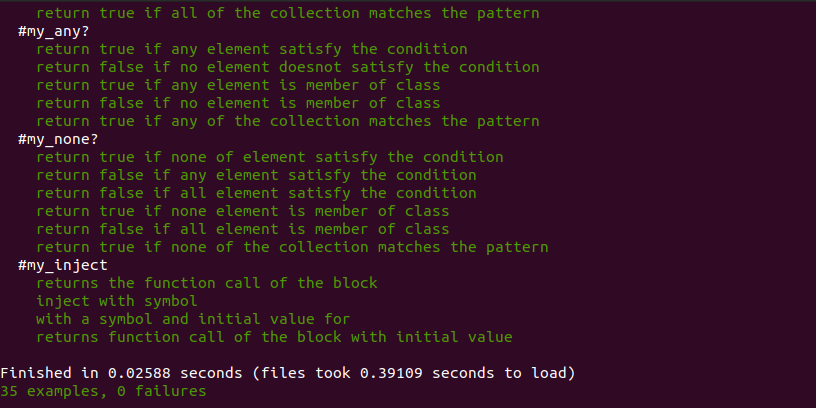

# Rspec_enumerables

Test for enumerables

This is a collaborative project about testing the some of the ruby(s) enumerables

It is is a Test Driven Development (TDD) project using Rspec to ratify the functionalities of

my own ruby's enumerables project by testing them with various conditions as they apply.
this way we can identify how well my own version of the Ruby's enumerables meet the functionality
of the original enumerable by comparing them using rspec.

# sample output

# Step to run the project

This project is created using rspec. rspec must be installed to run this

1. Fork/Clone this project to your local machine
2. Open terminal and navigate to project folder
3. Run rspec test using this commmand `rspec` at terminal

# Built With

-rubocop, VScode & ruby, Rspec

# Prerequisites

Visual Studio code editor

# Authors

👤 **Precious**

- Github: (https://github.com/evabanegacom)
- Linkedin:(https://www.linkedin.com/in/precious-udegbue-a3468314a/)

👤 **Karthi**

- Github: (https://github.com/karthi07)

# 🤝 Contributing

Contributions, issues and feature requests are welcome!

Feel free to check the issues page.

Show your support
Give a ⭐️ if you like this project!

# Acknowledgments

Testing my own enumerable methods with Rspec
etc
📝 License
This project is MIT licensed.
